<div align="center">

# 🏪 Regal Bayi Yönetim Sistemi

**Regal beyaz eşya ve küçük ev aletleri bayileri için geliştirilmiş**
**kapsamlı satış, stok ve finans yönetim uygulaması**

[](https://php.net)
[](https://mariadb.org)
[](https://getbootstrap.com)
[](LICENSE)

</div>

---

## 📋 İçindekiler

- [Özellikler](#-özellikler)
- [Ekran Görüntüleri](#-ekran-görüntüleri)
- [Kurulum](#-kurulum)
- [Modüller](#-modüller)
- [Güvenlik](#-güvenlik)
- [Teknolojiler](#-teknolojiler)
- [Lisans](#-lisans)

---

## ✨ Özellikler

### 💼 Satış Yönetimi
- ✅ Hızlı satış faturası oluşturma
- ✅ Barkod okuyucu + **kamera ile barkod tarama** (mobil)
- ✅ Taksitli satış (2x–36x, özel taksit sayısı)
- ✅ Nakit / Kredi Kartı / Havale / Taksitli ödeme tipleri
- ✅ Satır bazlı indirim (₺ veya %)
- ✅ Satış iptali ile otomatik stok iadesi

### 📦 Stok Takibi
- ✅ Ürün kataloğu (kod, barkod, kategori, model, renk)
- ✅ Gerçek zamanlı stok giriş / çıkış
- ✅ Kritik stok uyarısı
- ✅ Seri numarası takibi (büyük beyaz eşya için)
- ✅ Tedarikçi bazlı stok giriş geçmişi

### 💰 Finans & Kasa
- ✅ Kasa hareketleri (giriş/çıkış)
- ✅ Müşteri borç / alacak takibi
- ✅ Taksit ilerleme takibi (kaç taksit ödendi / kaldı)
- ✅ Bekleyen tahsilatlar listesi

### 👥 Müşteri Yönetimi
- ✅ Bireysel ve kurumsal müşteri kaydı
- ✅ Müşteri bazlı satış geçmişi
- ✅ Borç durumu ve tahsilat takibi

### 📊 Raporlar & Dashboard
- ✅ Günlük / aylık satış istatistikleri
- ✅ Aylık satış trendi grafiği (Chart.js)
- ✅ Kategoriye göre satış analizi
- ✅ En çok satan ürünler listesi
- ✅ Kasa özeti ve kar/zarar takibi

### 📱 Mobil Uyumlu
- ✅ Tam responsive tasarım (mobil / tablet / masaüstü)
- ✅ Mobil için **alt navigasyon çubuğu** (bottom nav)
- ✅ Off-canvas menü (hamburger)
- ✅ **Kamera ile barkod tarama** (EAN-13, UPC, QR vb.)
- ✅ Dokunma dostu arayüz

---

## 📸 Ekran Görüntüleri

### 🖥️ Masaüstü

| Giriş Ekranı | Dashboard |
|:------------:|:---------:|
| 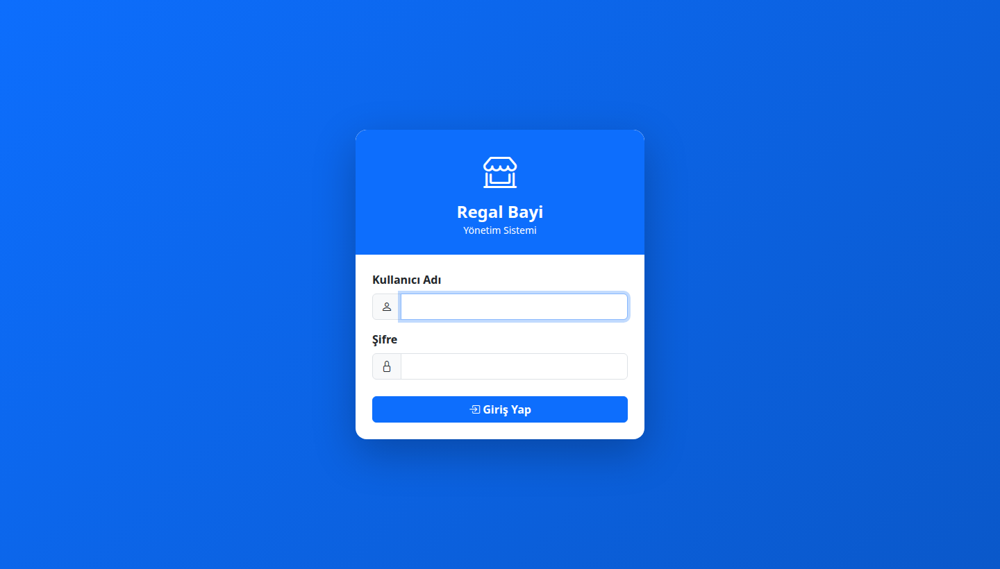 | 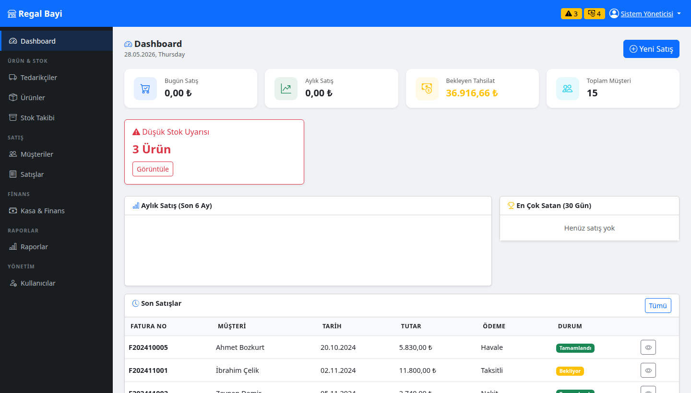 |

| Yeni Satış | Finans & Kasa |
|:----------:|:-------------:|
| 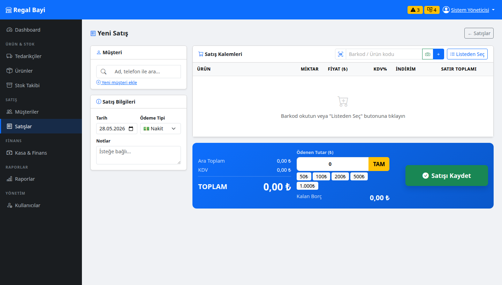 | 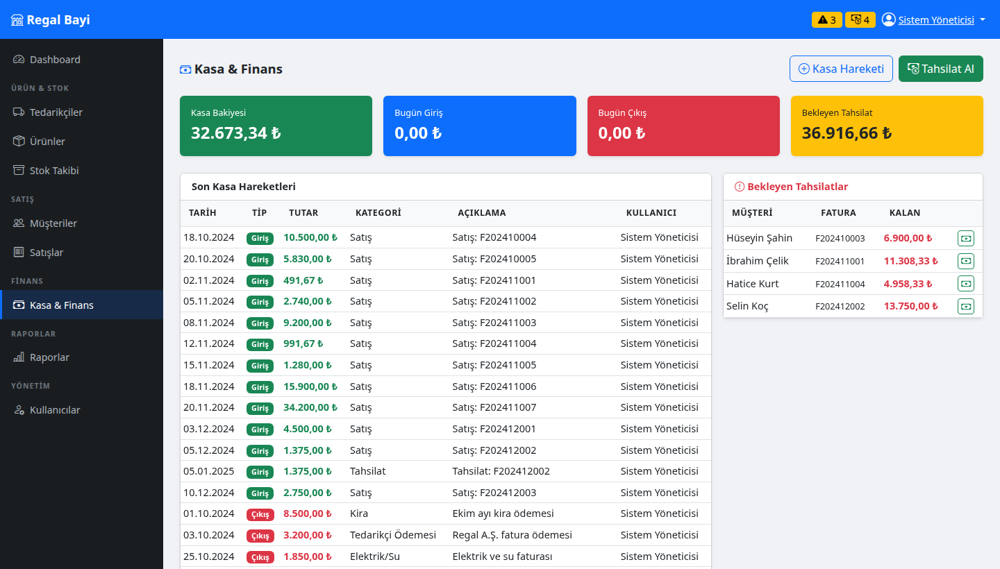 |

| Ürünler | Stok Takibi |
|:-------:|:-----------:|
| 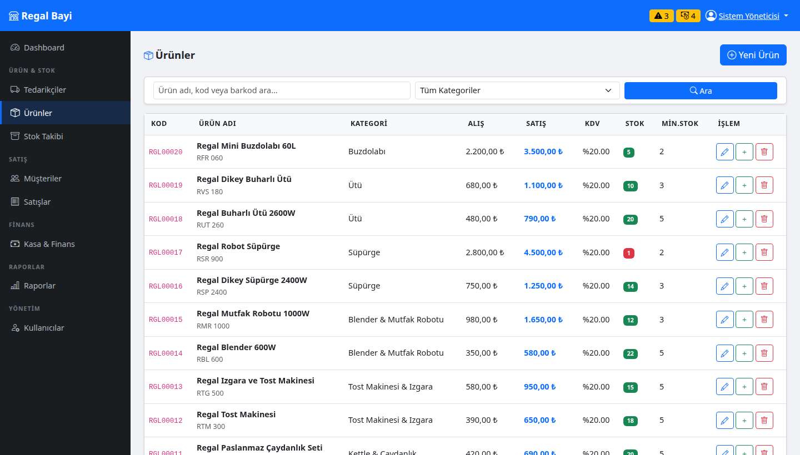 | 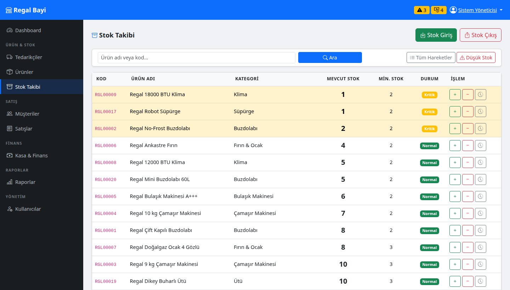 |

| Müşteriler | Raporlar |
|:----------:|:--------:|
| 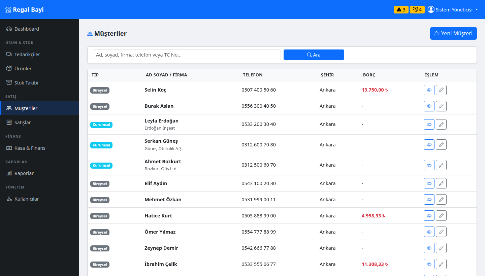 | 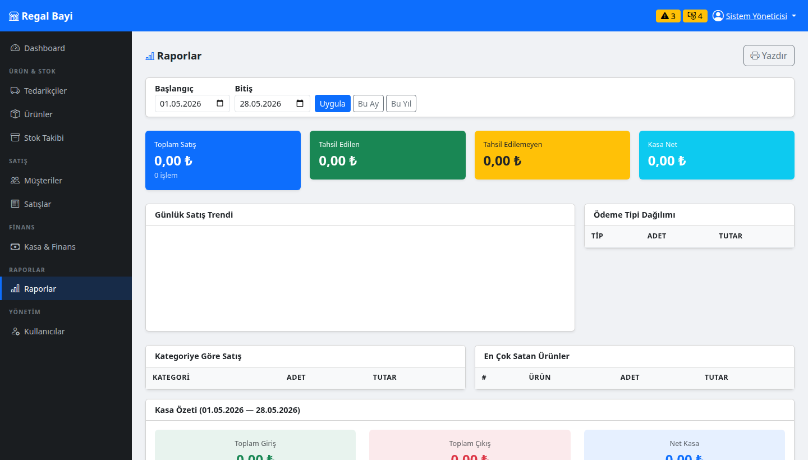 |

### 📱 Mobil (iPhone 14 — 390px)

| Mobil Dashboard | Mobil Yeni Satış | Mobil Stok |
|:---------------:|:----------------:|:----------:|
| 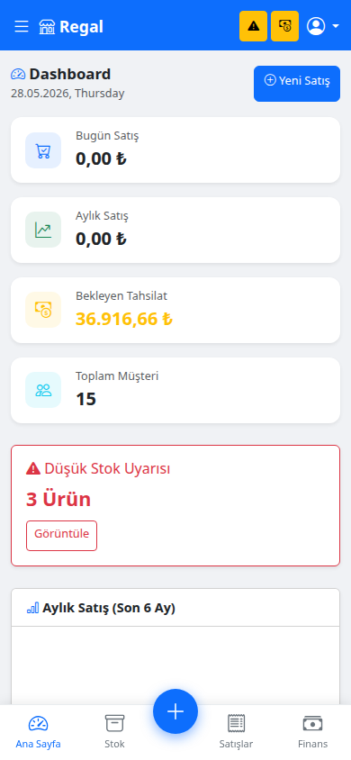 | 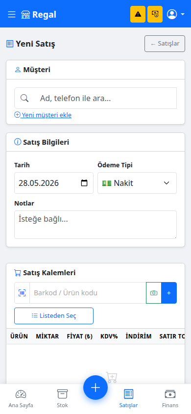 | 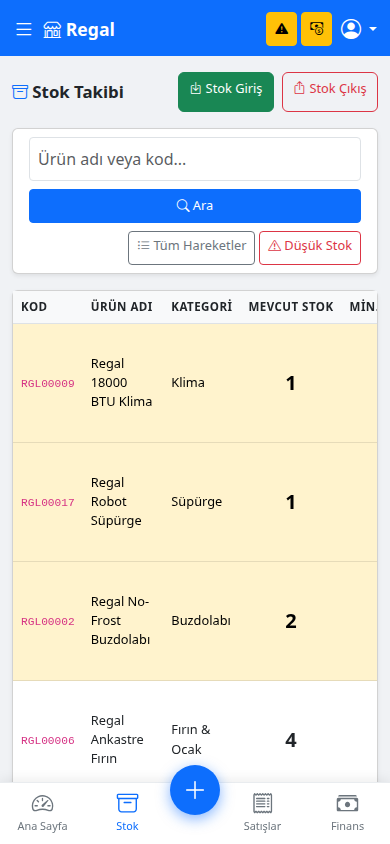 |

---

## 🚀 Kurulum

### Gereksinimler
- PHP 8.0+
- MySQL 5.7+ / MariaDB 10.4+
- Apache (XAMPP önerilir)

### Adımlar

**1. Repoyu klonlayın**
```bash
git clone https://github.com/DarkSaoul/regal-bayi.git
cd regal-bayi
```

**2. Web sunucusu dizinine taşıyın**
```bash
# XAMPP için:
cp -r . /opt/lampp/htdocs/regal/

# Windows XAMPP:
# C:\xampp\htdocs\regal\ dizinine kopyalayın
```

**3. Ortam dosyasını oluşturun**
```bash
cp .env.example .env
# .env dosyasını düzenleyin:
nano .env
```

```env
APP_ENV=development
DB_HOST=localhost
DB_USER=root
DB_PASS=
DB_NAME=regal_bayi
SESSION_TIMEOUT=1800
```

**4. Veritabanını oluşturun**
```bash
mysql -u root -p < sql/regal_bayi.sql
```

**5. Örnek veri ekleyin (opsiyonel)**
```bash
mysql -u root -p regal_bayi < sql/ornek_veri.sql
```

**6. Tarayıcıda açın**
```
http://localhost/regal
```

### Varsayılan Giriş
```
Kullanıcı adı : admin
Şifre         : admin123
```
> ⚠️ **Güvenlik:** İlk girişte şifrenizi mutlaka değiştirin!

---

## 📁 Modüller

| Modül | Açıklama |
|-------|----------|
| **Dashboard** | Genel bakış, istatistikler, grafikler, uyarılar |
| **Ürünler** | Ürün kataloğu CRUD, barkod, seri no takibi |
| **Stok** | Giriş/çıkış, hareketler, düşük stok uyarıları |
| **Tedarikçiler** | Tedarikçi yönetimi, stok giriş geçmişi |
| **Müşteriler** | Bireysel/kurumsal müşteri, borç takibi |
| **Satışlar** | Fatura oluşturma, taksit, iptal |
| **Finans** | Kasa hareketleri, tahsilat, bekleyen ödemeler |
| **Raporlar** | Satış analizi, grafik, kategori bazlı |
| **Kullanıcılar** | Çok kullanıcı desteği, rol tabanlı erişim |

### Kullanıcı Rolleri

| Rol | Yetki |
|-----|-------|
| **Yönetici** | Tüm modüller + kullanıcı yönetimi + satış iptali |
| **Kasiyer** | Satış, müşteri, stok giriş, finans |
| **Depo** | Stok görüntüleme |

---

## 🔐 Güvenlik

Bu uygulama **CVSS v4.0** metodolojisi ile güvenlik taramasından geçirilmiş, tespit edilen **15 güvenlik açığı** giderilmiştir:

- 🛡️ **CSRF Token** koruması — tüm POST işlemlerinde
- 🔒 **Brute-force** koruması — 5 başarısız deneme → 15 dk kilit
- ⏱️ **Session timeout** — 30 dakika hareketsizlik sonrası oturum kapatma
- 🔑 **Session fixation** koruması — başarılı girişte `session_regenerate_id()`
- 🗄️ **SQL Injection** koruması — tüm sorgularda Prepared Statement
- 🔍 **LIKE injection** koruması — özel karakterler escape ediliyor
- 🚫 **Stok race condition** — `SELECT ... FOR UPDATE` kilidi
- 🌐 **Security Headers** — `X-Content-Type-Options`, `X-Frame-Options`, vb.
- 📁 **Credential güvenliği** — DB şifresi `.env` dosyasında (kod içinde değil)
- 🔐 **Şifre politikası** — min 8 karakter, büyük/küçük harf + rakam zorunlu
- 🍪 **Cookie güvenliği** — `HttpOnly + SameSite=Lax`
- ❌ **Hata mesajı gizleme** — production'da sistem detayları gizlenir

---

## 🛠️ Teknolojiler

### Backend
- **PHP 8.2** — PDO, prepared statements, password_hash
- **MariaDB 10.4** — InnoDB, foreign key constraints, transactions

### Frontend
- **Bootstrap 5.3** — Responsive grid, offcanvas, modals
- **Bootstrap Icons 1.11** — İkon seti
- **Chart.js 4.4** — Dashboard grafikleri
- **html5-qrcode 2.3** — Kamera barkod tarayıcı

### Araçlar & Mimari
- Düz PHP (framework bağımlılığı yok)
- MVC benzeri modüler yapı
- `.env` tabanlı yapılandırma
- CSRF token sistemi

---

## 📂 Proje Yapısı

```
regal/
├── .env.example            # Örnek ortam değişkenleri
├── .gitignore
├── index.php               # Giriş yönlendirme
├── config/
│   └── database.php        # PDO bağlantısı
├── includes/
│   ├── functions.php       # Yardımcı fonksiyonlar (CSRF, auth, vb.)
│   ├── header.php          # Navbar + sidebar
│   ├── footer.php          # Alt nav + JS
│   └── sidebar_nav.php     # Navigasyon menüsü
├── assets/
│   ├── css/style.css       # Ana stil (responsive)
│   ├── js/main.js          # Satış hesaplama, taksit
│   └── js/barcode-scanner.js  # Kamera barkod modülü
├── modules/
│   ├── auth/               # Giriş / Çıkış
│   ├── dashboard/          # Ana sayfa
│   ├── urunler/            # Ürün yönetimi
│   ├── stok/               # Stok takibi
│   ├── musteriler/         # Müşteri yönetimi
│   ├── satislar/           # Satış işlemleri
│   ├── finans/             # Kasa & tahsilat
│   ├── tedarikciler/       # Tedarikçi yönetimi
│   ├── raporlar/           # Raporlar
│   └── kullanicilar/       # Kullanıcı yönetimi
└── sql/
    └── regal_bayi.sql      # Veritabanı şeması
```

---

## 🤝 Katkıda Bulunma

1. Bu repoyu fork edin
2. Feature branch oluşturun (`git checkout -b feature/yeni-ozellik`)
3. Değişikliklerinizi commit edin (`git commit -m 'feat: yeni özellik eklendi'`)
4. Branch'i push edin (`git push origin feature/yeni-ozellik`)
5. Pull Request açın

---

## 📄 Lisans

Bu proje [MIT Lisansı](LICENSE) ile lisanslanmıştır.

---

<div align="center">

**⭐ Beğendiyseniz yıldız vermeyi unutmayın!**

Geliştirici: [DarkSaoul](https://github.com/DarkSaoul) | tancantolga9@gmail.com

</div>
